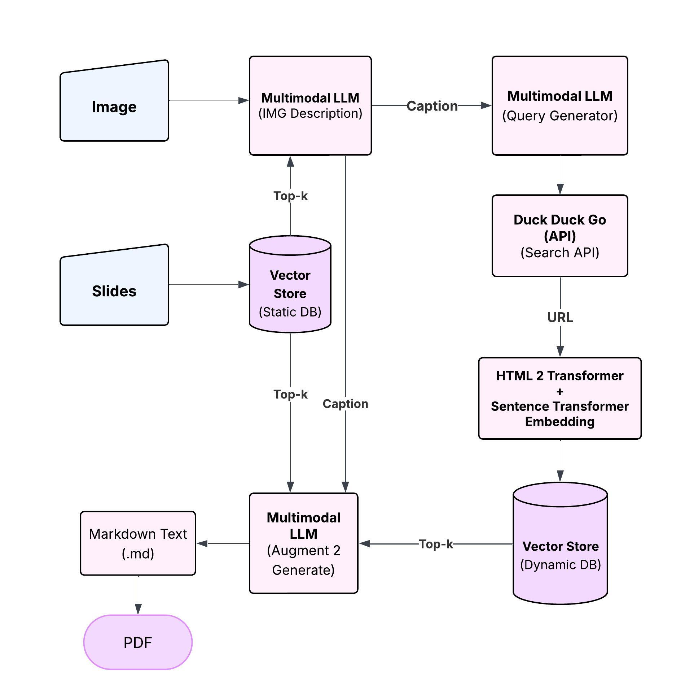

# Vision to Manufacture: A Fully Local Manufacturing Deep Search Engine

This project aims to develop a robust, self-contained system for manufacturing knowledge retrieval and analysis, designed to operate entirely offline. Drawing inspiration from deep semantic search capabilities such as those found in ChatGPT Deep Search, the system is specifically tailored to extract, organize, and synthesize manufacturing-related information with a high degree of relevance and contextual understanding.

## Project Overview
The system is intended to support manufacturing engineers, product developers, and sustainability analysts by automating the discovery and structuring of technical content. Its primary functions include:
- Detailed, step-by-step manufacturing process documentation
- Identification of sustainable and alternative material options
- Comparative cost analysis across manufacturing methods

## Technical Approach
At the core of the system is a vision-to-query pipeline. The workflow begins with an image input, from which the system identifies the depicted object using a pretrained vision-language model. Based on the object classification, the system generates semantically rich manufacturing-related queries, which are executed through a fully offline web scraping engine. The retrieved content is then embedded into a local semantic vector database to enable efficient and high-fidelity retrieval.

In parallel, the system maintains a static vector base, constructed from curated course materials and manufacturing references. This enables hybrid retrieval: combining both static and dynamic sources to maximize the relevance and completeness of the information retrieved.

The integrated knowledge base—comprising both dynamically scraped and pre-curated content—is accessed using a Retrieval-Augmented Generation (RAG) framework. LangChain is employed to orchestrate query generation, prompt structuring, and multi-step reasoning. ChromaDB serves as the local vector store, supporting scalable and performant semantic search.

The final output is a comprehensive, professional-grade manufacturing report that outlines how to fabricate the identified object. This report encompasses manufacturing methods, required materials, sustainability metrics, cost considerations, and performance trade-offs, thereby serving as a domain-specific decision-support artifact.

The system architecture and pipeline are illustrated in the following diagram:
<p align="center">
  
</p>


## Repository Overview

### 1. Jupyter Notebook: `manufacturing.ipynb`
The notebook contains:
- Implementation of a fully offline web scraper.
- Integration of machine learning models for generating search queries.
- Data processing and visualization for manufacturing research.

### 2. Pre-trained Models
The project uses pre-trained models (e.g., `gemma3:4b`) to enhance query generation and data analysis capabilities. 

### 3. Sample Images and Outputs
A set of sample images (`/imgs`) and outputs (`/sample_outputs`) are included to demonstrate image-based captioning and query generation.

## How to Run

1. Clone the repository:
   ```bash
   git clone https://github.com/vinay-lanka/local-deep-research.git
   cd local-deep-research
   ```

2. Install the required dependencies:
   ```bash
   conda env create -f environment.yml

   # Ollama install
   curl -fsSL https://ollama.com/install.sh | sh
   ollama pull gemma3:4b
   ```

   
3. Open the Jupyter Notebook:
   ```bash
   jupyter notebook manufacturing.ipynb
   ```